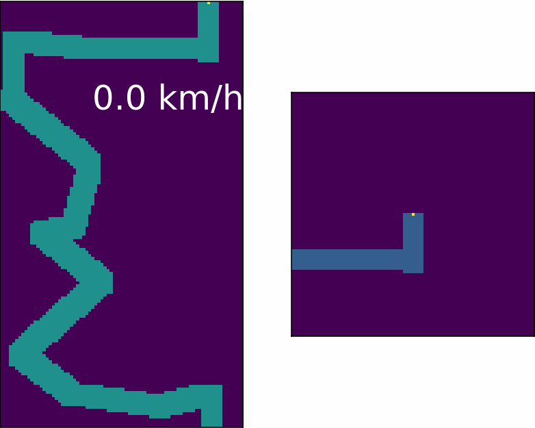

## 2D self-driving car model

## Environment
* PyTorch v1.9.0
* Numpy v1.21.2
* Matplotlib v3.5.0

## Algorithm
Advantage Actor Critic (A2C)

## Result
Trained at short distances, the car model can handle distances of any length.

## Notebooks
  1. [How to build a trajectory](trajectory.ipynb)
  2. [How environment works](env.ipynb)
  3. [Train, evaluate and animate model](train.ipynb)